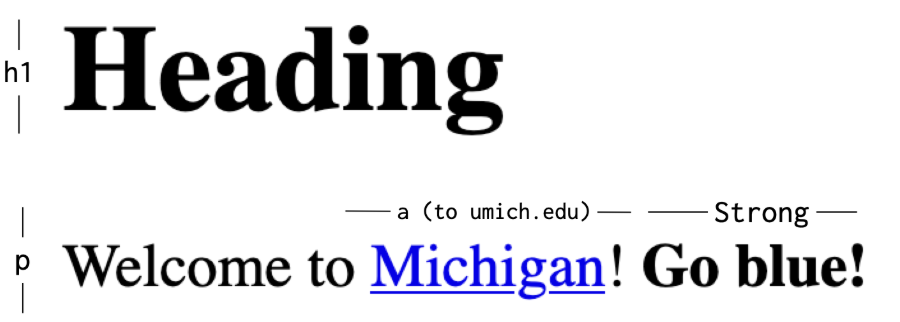

# Problem 1: HTML Text and Links for a Welcome Page

Edit `Problem 1/index.html`:

Create a webpage that includes a heading and a paragraph. The paragraph should have a link and bold text inside it.

Edit the HTML code so that the `<body>` element contains the following:

1. An `<h1>` element with the text: `Heading` (This is the main heading of your page.)
2. A `
` element (paragraph) with this text: `Welcome to Michigan! Go blue!` Inside the paragraph:
    - The word `Michigan` should be a clickable link that goes to `https://umich.edu/`.
      - Use an `<a>` (anchor) tag for the link.
      - Set the `href` attribute of the `<a>` tag to `https://umich.edu/`.
    - The text `Go blue!` should be bolded.
      - Use the `<strong>` or `<b>` tag for bold text.

The resulting page should look similar to this image (without annotations):

---

Course 1, Module 1 - graded assignment: [Module 1 Graded Assignment](https://www.coursera.org/learn/web-development-fundamentals-html-css-javascript/programming/xtD2M/module-1-graded-assignment) - `Problem 1`

The files here are the starter you get in the course. Solutions to graded
assignments are not published.
