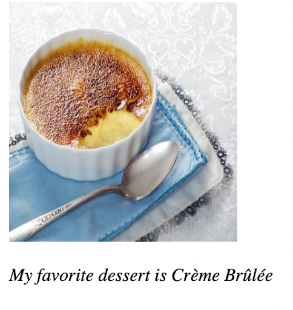

# Problem 2: Semantic HTML for a Dessert Figure

Edit `Problem 2/index.html`:

Create a webpage that shows an image of your favorite dessert and a caption underneath it. Inside the `<body>`, **create a `<figure>` element** that contains:

- An `` element that displays a picture of your favorite dessert. You can use `src="creme_brulee.jpg"` to link to the image already included in this project, use a URL to an image online, or save and link your own image. Include an `alt` attribute that describes the image.
- A `<figcaption>` element under the image with the text: `"My favorite dessert is [your favorite dessert]"` Replace the part in brackets with your actual favorite dessert. Put the whole sentence inside an `<em>` element so the caption is emphasized.

The resulting page should look similar to this image:

---

Course 1, Module 1 - graded assignment: [Module 1 Graded Assignment](https://www.coursera.org/learn/web-development-fundamentals-html-css-javascript/programming/xtD2M/module-1-graded-assignment) - `Problem 2`

The files here are the starter you get in the course. Solutions to graded
assignments are not published.
