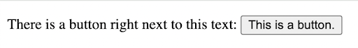

# Problem 3: Inline HTML Elements for a Text Button

Edit `Problem 3/index.html`:

Inside the `<body>` element, create a paragraph with a button right next to the text, all on the same line.

Your page must include:
1. A `
` element with the text: `"There is a button right next to this text: "` This `
` element should have a class called `paragraph` (add `class="paragraph"` in the tag).
2. After the sentence inside the paragraph, add a `<button>` element that says: `"This is a button."` Both the text and the button should be inside the same `
` element, so the button shows up right after the sentence.

The resulting page should look similar to this image:

---

Course 1, Module 1 - graded assignment: [Module 1 Graded Assignment](https://www.coursera.org/learn/web-development-fundamentals-html-css-javascript/programming/xtD2M/module-1-graded-assignment) - `Problem 3`

The files here are the starter you get in the course. Solutions to graded
assignments are not published.
