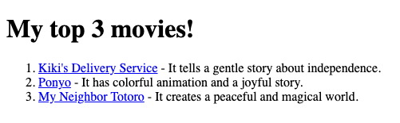

# Problem 4: Ordered Lists for Favorite Movies

Edit `Problem 4/index.html`:

Let's create a heading and a ranked list of your top three favorite movies. Since this is a ranked list, use an ordered list.

In the `<body>` element, include the following:

1. An `<h1>` element with the text: `"My top 3 movies!"`
2. An `<ol>` element (ordered list) that contains exactly 3 `<li>` items (list items).
3. Inside each `<li>` item:
    - Add one clickable link to a page about that movie. Use an `<a>` tag with the movie title as the link text. A Wikipedia page is a good option.
        - Use the `href` attribute to set the link to the movie's page.
    - After the link, add a short sentence explaining why the movie belongs in your top three.

The resulting page should look similar to this image:

---

Course 1, Module 1 - graded assignment: [Module 1 Graded Assignment](https://www.coursera.org/learn/web-development-fundamentals-html-css-javascript/programming/xtD2M/module-1-graded-assignment) - `Problem 4`

The files here are the starter you get in the course. Solutions to graded
assignments are not published.
