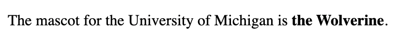

# Problem 1: Strong Text for a Mascot Sentence

Edit `Lesson 2.1/index.html`:

Create a `
` element with the text: "The mascot for the University of Michigan is **the Wolverine**." Put the text "the Wolverine" inside a `<strong>` tag.

***Note 1**: The `<strong>` tag makes the text inside it bold.*

***Note 2**: The specifics matter; double check your capitalization, spelling, and punctuation. Also, the "period" should **not** be inside the `<strong>` tag.*

The resulting page should look similar to this image:

---

Course 1, Module 1 - practice assignment (ungraded): [Practice: HTML Elements](https://www.coursera.org/learn/web-development-fundamentals-html-css-javascript/programming/2R9C6/practice-html-elements) - `Lesson 2.1`

The files here are the starter you get in the course. The finished `index.html` is in the [solution folder on GitHub](https://github.com/soney/Practical-JavaScript/tree/main/assignments/Course%201/Module%201/Lesson%202/Lesson%202.1/solution); in the course codespace that folder is hidden so you can work the problem first.
