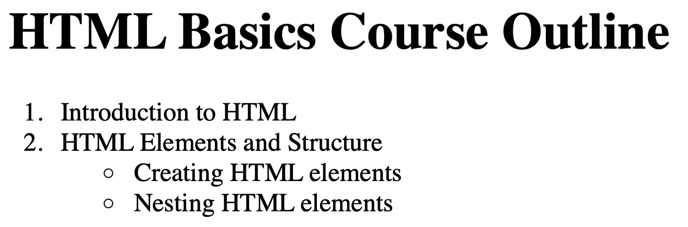

# Problem 3: Nested HTML for a Course Outline

Edit `Lesson 2.3/index.html`:

Inside the `<body>` element, create a course outline with this exact structure:

1. Add one `<h1>` element with the exact text `HTML Basics Course Outline`.
2. Below the `<h1>`, add one ordered list, using an `<ol>` element.
3. The `<ol>` must contain exactly two top-level `<li>` elements, in this order:
   - `Introduction to HTML`
   - `HTML Elements and Structure`
4. Inside the second top-level `<li>`, after the text `HTML Elements and Structure`, add one unordered list, using a `<ul>` element.
5. The nested `<ul>` must contain exactly two `<li>` elements, in this order:
   - `Creating HTML elements`
   - `Nesting HTML elements`

Do not add extra lesson items or topic items.

The resulting page should look similar to this image:

---

Course 1, Module 1 - practice assignment (ungraded): [Practice: HTML Elements](https://www.coursera.org/learn/web-development-fundamentals-html-css-javascript/programming/2R9C6/practice-html-elements) - `Lesson 2.3`

The files here are the starter you get in the course. The finished `index.html` is in the [solution folder on GitHub](https://github.com/soney/Practical-JavaScript/tree/main/assignments/Course%201/Module%201/Lesson%202/Lesson%202.3/solution); in the course codespace that folder is hidden so you can work the problem first.
