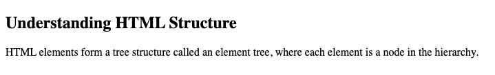

# Problem 4: Nested Elements for an HTML Tutorial

Edit `Lesson 2.4/index.html`:

Inside the `<body>` element, create a short HTML tutorial section. This task is about nesting elements correctly, so pay close attention to which elements go inside other elements.

**Your page must include:**
1. A `<section>` element.
2. Inside the `<section>`, an `<h2>` element with the exact text: `Understanding HTML Structure`
3. After the `<h2>`, but still inside the same `<section>`, a `
` element.
4. Inside the `
`, one `
` element with this full sentence: `HTML elements form a tree structure called an element tree, where each element is a node in the hierarchy.`
5. Inside the paragraph, wrap only the words `element tree` in a `` element.
    - The comma should come immediately after the closing `` tag, like this: `element tree,`

The final element tree should be:

- section
  - h2
  - div
    - p
      - span

The resulting page should look similar to this image:

---

Course 1, Module 1 - practice assignment (ungraded): [Practice: HTML Elements](https://www.coursera.org/learn/web-development-fundamentals-html-css-javascript/programming/2R9C6/practice-html-elements) - `Lesson 2.4`

The files here are the starter you get in the course. The finished `index.html` is in the [solution folder on GitHub](https://github.com/soney/Practical-JavaScript/tree/main/assignments/Course%201/Module%201/Lesson%202/Lesson%202.4/solution); in the course codespace that folder is hidden so you can work the problem first.
