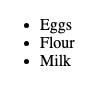

# Problem 1: HTML Attributes for a Recipe List

Edit `Lesson 3.1/index.html`:

Inside the `<body>` element, create an ingredients list for a recipe.

We will also set the `class` and `id` attributes on the elements. Although setting these attributes will *not* change the appearance of the page, we will see how they can be used in later lessons on CSS and JavaScript.

**Your page must include:**
1. A `
` element with `class="container"`.
2. Inside the `
`, a `<ul>` element with `id="listOfIngredients"`.
3. Inside the `<ul>`, exactly three `<li>` elements, in this order:
   - `Eggs`
   - `Flour`
   - `Milk`

Make sure the `<ul>` is inside the `
`, and all three `<li>` elements are inside the `<ul>`.

The resulting page should look similar to this image:

---

Course 1, Module 1 - practice assignment (ungraded): [Practice: Working with HTML Attributes](https://www.coursera.org/learn/web-development-fundamentals-html-css-javascript/programming/vNnYp/practice-working-with-html-attributes) - `Lesson 3.1`

The files here are the starter you get in the course. The finished `index.html` is in the [solution folder on GitHub](https://github.com/soney/Practical-JavaScript/tree/main/assignments/Course%201/Module%201/Lesson%203/Lesson%203.1/solution); in the course codespace that folder is hidden so you can work the problem first.
