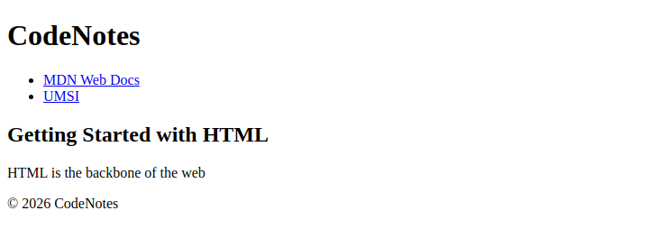

# Problem 2: Semantic HTML for a Tech Blog

Edit `Lesson 3.2/index.html`:

You are building the homepage for a personal **tech blog** called *CodeNotes*. This time, the navigation links will point to real websites. If you click one of them in your browser preview, it will take you to that site (use the browser's Back button to return to your page).

Write HTML code that includes:

- A `<header>` element
  - Inside the `<header>`, add one `<h1>` element
    - The `<h1>` text should be (exactly) `CodeNotes`
- A `<nav>` element for the navigation menu after the `<header>` element (the `<nav>` should be a sibling of the `<header>`)
  - Inside the `<nav>`, add one unordered list (`<ul>`)
    - Inside the `<ul>`, create exactly two list items (`<li>`)
      - Each `<li>` should contain one link (`<a>`)
        - The first link text must be exactly `MDN Web Docs` and its `href` must be exactly `https://developer.mozilla.org/`
        - The second link text must be exactly `UMSI` and its `href` must be exactly `https://si.umich.edu/` (UMSI is the University of Michigan School of Information)
- A `<main>` element for the main page content after the `<nav>` element (the `<main>` should be a sibling of the `<nav>`)
  - Inside the `<main>`, add one `<article>` element
    - Inside the `<article>`, add one `<h2>` with the exact text `Getting Started with HTML`
    - Inside the same `<article>`, add one `
` with the text `HTML is the backbone of the web`
- A `<footer>` element after the `<main>` element (the `<footer>` should be a sibling of the `<main>`)
  - Inside the `<footer>`, add one `
` element
    - The footer text in the `
` element must be exactly `© 2026 CodeNotes`
      - The `©` symbol can be added either using the HTML entity `&copy;` or by copy/pasting the symbol directly into your code.

The resulting page should look similar to this image:

---

Course 1, Module 1 - practice assignment (ungraded): [Practice: Working with HTML Attributes](https://www.coursera.org/learn/web-development-fundamentals-html-css-javascript/programming/vNnYp/practice-working-with-html-attributes) - `Lesson 3.2`

The files here are the starter you get in the course. [`solution/index.html`](solution/index.html) is the finished `index.html`; copy it over the starter to run the completed assignment.
