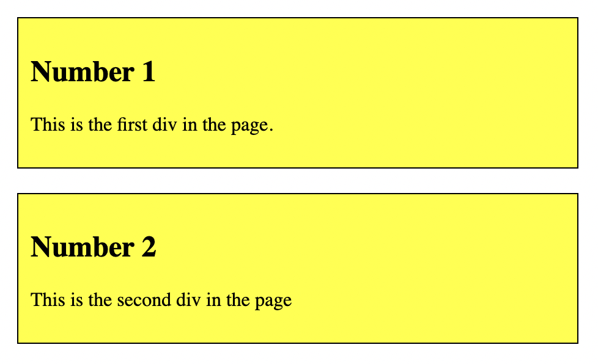

# Problem 2: CSS Classes for Yellow Boxes

Edit `Problem 2/index.html`:

The starter file already has an empty `<style>` element inside the `<head>` section. Add your CSS rules inside that `<style>` element.

1. For the `.box` selector:
    - Set `background-color` to `yellow`.
    - Set `padding` to `10px`.
    - Set `border` to `1px solid black`.
    - Set `margin` to `20px`.
2. For the elements with IDs `description1` and `description2`:
    - Set `font-size` to `20px`.

The resulting page should look similar to this image:

---

Course 1, Module 2 - graded assignment: [Module 2 Graded Assignment](https://www.coursera.org/learn/web-development-fundamentals-html-css-javascript/programming/ZCGkg/module-2-graded-assignment) - `Problem 2`

The files here are the starter you get in the course. Solutions to graded
assignments are not published.
