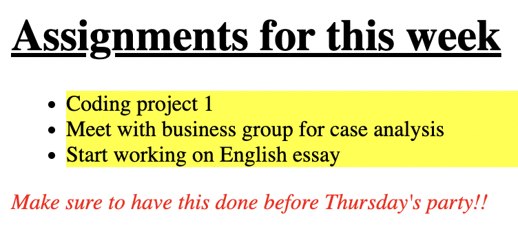

# Problem 2: CSS Colors for a Styled Page

Edit `Lesson 1.2/index.html`:

The starter file already has an empty `<style>` element inside the `<head>` section. Add your CSS rules inside that `<style>` element.

Do not change the HTML content inside the `<body>`, and do not use inline `style` attributes.

Add CSS rules with these selectors, properties, and values:

1. For the `li` selector:
   - Set `background-color` to `yellow`.
   - Set `font-size` to `16px`.
2. For the `h1` selector:
   - Set `text-decoration` to `underline`.
3. For the `p` selector:
   - Set `color` to `red`.
   - Set `font-style` to `italic`.

The resulting page should look similar to this image:

---

Course 1, Module 2 - practice assignment (ungraded): [Practice: Adding CSS](https://www.coursera.org/learn/web-development-fundamentals-html-css-javascript/programming/OzFCf/practice-adding-css) - `Lesson 1.2`

The files here are the starter you get in the course. [`solution/index.html`](solution/index.html) is the finished `index.html`; copy it over the starter to run the completed assignment.
