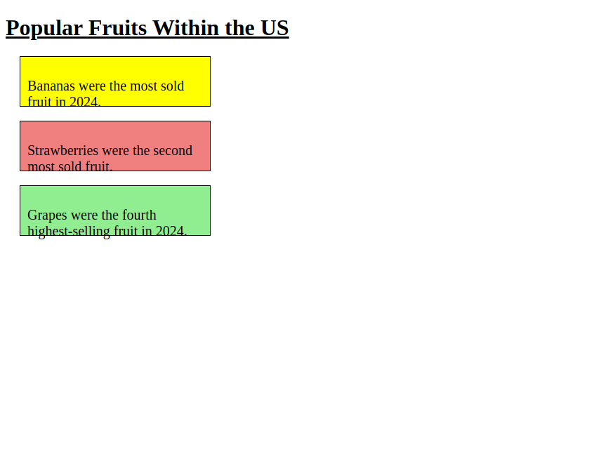

# Problem 1: CSS Selectors for Page Text

Edit `Lesson 2.1/index.html`:

The starter file already has an empty `<style>` element inside the `<head>` section. Add your CSS rules inside that `<style>` element.

Add CSS rules with these selectors, properties, and values:

1. For the `h1` selector:
   - Set `text-decoration` to `underline`.
   - Set `font-family` to `"Mononoki"`.
2. For the `div` selector:
   - Set `border` to `1px solid black`.
   - Set `margin` to `20px`.
   - Set `padding` to `10px`.
   - Set `width` to `250px`.
   - Set `height` to `50px`.
3. For the `p` selector:
   - Set `font-size` to `20px`.
4. For the `#banana` selector:
   - Set `background-color` to `yellow`.
5. For the `#strawberry` selector:
   - Set `background-color` to `lightcoral`.
6. For the `#grape` selector:
   - Set `background-color` to `lightgreen`.

The resulting page should look similar to this image:

---

Course 1, Module 2 - practice assignment (ungraded): [Practice: Essential CSS](https://www.coursera.org/learn/web-development-fundamentals-html-css-javascript/programming/F27Ox/practice-essential-css) - `Lesson 2.1`

The files here are the starter you get in the course. The finished `index.html` is in the [solution folder on GitHub](https://github.com/soney/Practical-JavaScript/tree/main/assignments/Course%201/Module%202/Lesson%202/Lesson%202.1/solution); in the course codespace that folder is hidden so you can work the problem first.
