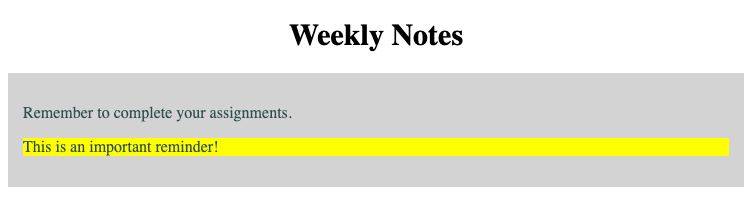

# Problem 2: CSS Selectors for Existing Content

Edit `Lesson 2.2/index.html`:

Modify the existing content using CSS selectors.

The starter file already has a `<style>` element inside the `<head>` section. Add your CSS rules inside that `<style>` element.

Add CSS rules with these selectors, properties, and values:

1. For the `h1` selector:
   - Set `text-align` to `center`.
   - Set `font-size` to `30px`.
2. For the `p` selector:
   - Set `font-size` to `16px`.
   - Set `color` to `darkslategray`.
3. For the `#note` selector:
   - Set `background-color` to `yellow`.
4. For the `section` selector:
   - Set `background-color` to `lightgray`.
   - Set `padding` to `15px`.

The resulting page should look similar to this image:

---

Course 1, Module 2 - practice assignment (ungraded): [Practice: Essential CSS](https://www.coursera.org/learn/web-development-fundamentals-html-css-javascript/programming/F27Ox/practice-essential-css) - `Lesson 2.2`

The files here are the starter you get in the course. The finished `index.html` is in the [solution folder on GitHub](https://github.com/soney/Practical-JavaScript/tree/main/assignments/Course%201/Module%202/Lesson%202/Lesson%202.2/solution); in the course codespace that folder is hidden so you can work the problem first.
