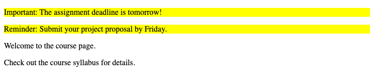

# Problem 3: CSS Classes for Course Notifications

Edit `Lesson 2.3/index.html`:

You are designing a notifications section for a University of Michigan course page.

Add a `<style>` element inside the `<head>` section. Inside that `<style>` element, add one CSS rule:

1. For the `.alert` selector:
   - Set `background-color` to `yellow`.

Then update the existing paragraphs in the `<body>`:

1. Add `class="alert"` to exactly two paragraphs:
   - `Important: The assignment deadline is tomorrow!`
   - `Reminder: Submit your project proposal by Friday.`
2. Leave exactly two paragraphs without the `alert` class:
   - `Welcome to the course page.`
   - `Check out the course syllabus for details.`

Only the paragraphs with `class="alert"` should have a yellow background.

The resulting page should look similar to this image:

---

Course 1, Module 2 - practice assignment (ungraded): [Practice: Essential CSS](https://www.coursera.org/learn/web-development-fundamentals-html-css-javascript/programming/F27Ox/practice-essential-css) - `Lesson 2.3`

The files here are the starter you get in the course. [`solution/index.html`](solution/index.html) is the finished `index.html`; copy it over the starter to run the completed assignment.
