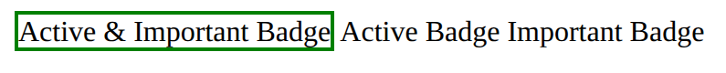

# Problem 4: Combined Class Selectors for Course Badges

Edit `Lesson 2.4/index.html`:

A CSS selector that chains class names together with **no spaces** (like `.badge.active.important`) matches only elements that have **all** of those classes at the same time. In this problem you'll use one to highlight a single badge out of three.

The starter file already has three `<span>` badges in the `<body>`.

## Step 1: Give each badge its classes

Add a `class` attribute to each `<span>` so the three badges have these class combinations:

```html
<span class="badge active important">Active & Important Badge</span>
<span class="badge active">Active Badge</span>
<span class="badge important">Important Badge</span>
```

Every badge has the `badge` class, but only the first one has all three (`badge`, `active`, and `important`).

## Step 2: Style only the badge that has all three classes

Add a `<style>` element inside the `<head>`, and inside it write one rule using the combined class selector:

```css
.badge.active.important {
    border: 2px solid green;
}
```

Because the class names are joined with no spaces, this selector only matches an element that has `badge` **and** `active` **and** `important`. That is only the first badge, so only it gets the green border. The other two are each missing one of the three classes, so the rule does not apply to them.

The resulting page should look similar to this image:



---

Course 1, Module 2 - practice assignment (ungraded): [Practice: Essential CSS](https://www.coursera.org/learn/web-development-fundamentals-html-css-javascript/programming/F27Ox/practice-essential-css) - `Lesson 2.4`

The files here are the starter you get in the course. The finished `index.html` is in the [solution folder on GitHub](https://github.com/soney/Practical-JavaScript/tree/main/assignments/Course%201/Module%202/Lesson%202/Lesson%202.4/solution); in the course codespace that folder is hidden so you can work the problem first.
