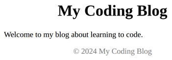

# Problem 1: Semantic Page Structure

Edit `Lesson 3.1/index.html`:

*Semantic HTML* means choosing elements that describe what your content **means**, not only how it looks. Instead of wrapping everything in generic `
` elements, you use elements like `<header>`, `<main>`, and `<footer>` that tell the browser (and screen readers and search engines) what each part of the page is for.

The starter file wraps three sections of a blog page in plain `
` elements:

- a top section with the site title,
- a middle section with the main content,
- a bottom section with the copyright notice.

Replace each `
` with the semantic element that best describes its content. Keep the content inside each element exactly as it is. Only change the three wrapper `
` tags.

1. Replace the `
` around the `<h1>` title with a `<header>` element.
2. Replace the `
` around the main paragraph with a `<main>` element.
3. Replace the `
` around the copyright paragraph with a `<footer>` element.

The `<style>` in the `<head>` already targets `header` and `footer` by their tag names. Because you are now using the real semantic elements (instead of `
`s), those rules apply automatically: the header and footer become centered, and the footer text turns gray.

The resulting page should look similar to this image:

---

Course 1, Module 2 - practice assignment (ungraded): [Practice: CSS in Practice](https://www.coursera.org/learn/web-development-fundamentals-html-css-javascript/programming/m1vJQ/practice-css-in-practice) - `Lesson 3.1`

The files here are the starter you get in the course. [`solution/index.html`](solution/index.html) is the finished `index.html`; copy it over the starter to run the completed assignment.
