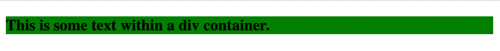

# Problem 1: DOM Class Updates for Styled Elements

Edit `Problem 1/index.html`:

When a page loads, JavaScript can change how elements look by editing their classes and attributes. In this problem you will turn an **orange** container **green** and make its paragraph **bold**, all from JavaScript. The starter page has one `
` with a `
` inside it, plus an empty `<style>` and an empty `<script>`.

## Step 1: Add the CSS rules

Inside the existing `<style>` element, add three rules (`.` selects a class, `#` selects an ID):

- `.orange_container`: set `background-color` to `orange`.
- `.green_container`: set `background-color` to `green`.
- `#bolded`: set `font-weight` to `bold`.

## Step 2: In the `<script>`, change the div from orange to green

- **Select the div.** There is only one `
` on the page, so `document.querySelector('div')` will return it; `querySelector` finds the first element that matches a CSS selector. Store the result in a variable.
- **Swap its class.** Every element has a `classList` with a `.remove('className')` method to take a class off and an `.add('className')` method to put one on. Use them to remove `orange_container` and add `green_container`.

## Step 3: In the same `<script>`, make the paragraph bold

- **Select the paragraph.** The `
` sits inside the `
`, so you can search within the element you already selected (the same `querySelector` method works on any element, not only `document`).
- **Give it an ID.** `setAttribute(name, value)` adds (or updates) an attribute on an element. Use it to give the paragraph the ID `bolded`. Because your `#bolded` rule sets `font-weight: bold`, the paragraph will then appear bold.

The resulting page should look similar to this image:

---

Course 1, Module 4 - graded assignment: [Module 4 Graded Assignment](https://www.coursera.org/learn/web-development-fundamentals-html-css-javascript/programming/Itkd1/module-4-graded-assignment) - `Problem 1`

The files here are the starter you get in the course. Solutions to graded
assignments are not published.
