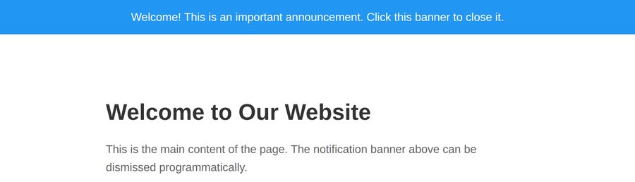

# Problem 3: DOM Removal for a Notification Banner

Edit `Problem 3/main-3.js`:

- Note 1: For this problem, you will **only** edit the JavaScript file, `Problem 3/main-3.js`. **Do not modify the HTML file**, `Problem 3/index.html`.

Create a function that removes the notification banner from the page.

1. Define a function named `dismissNotification`.
   - The function should not take any parameters.
2. Inside `dismissNotification`, select the banner element:
   - Use `document.querySelector('#notification-banner')` and store the result in a variable named `notificationBanner`.
3. Check whether the banner exists. When `document.querySelector` finds no matching element, it returns `null`.
   - If `notificationBanner` is `null`, the banner is not on the page, so return `false` right away. You can check this with an `if` statement, for example `if (notificationBanner === null) { return false; }`.
4. Otherwise, remove the banner and report success.
   - Call the element's `remove()` method to take it off the page (do not just hide it with CSS).
   - Return `true` after removing it.
5. After the function, select `#notification-banner` and add a `"click"` event listener to it.
   - When the banner is clicked, call `dismissNotification`.

Calling `dismissNotification()` while the banner exists should remove it (so `#notification-banner` no longer exists in the document) and return `true`.

Clicking the banner should also make `#notification-banner` no longer exist in the document.

If `dismissNotification()` is called again after the banner has already been removed, `document.querySelector` returns `null`, so the function should return `false` and must not throw an error.

When the page first loads, the notification banner appears at the top:

After clicking `#notification-banner` (or calling `dismissNotification()`), the banner is removed and the page should look similar to this image:

---

Course 2, Module 1 - graded assignment: [Module 1 Graded Assignment](https://www.coursera.org/learn/building-interactive-web-applications-with-javascript/programming/V9HKL/module-1-graded-assignment) - `Problem 3`

The files here are the starter you get in the course. Solutions to graded
assignments are not published.
