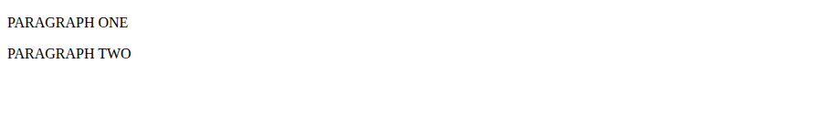

# Problem 2: Selecting and Updating Nested Paragraphs

Edit `Lesson 1.2/index.html`:

The starter file already has this HTML structure:

```html
<section id="content">
  <div class="card">
    <p class="text">Paragraph One</p>
    <p class="text">Paragraph Two</p>
  </div>
</section>
```

Write your JavaScript inside the existing `<script>` element. Do not change the HTML structure.

Your JavaScript should do these steps in order:

1. Select the `<section>` element using `document.querySelector()` and store it in a variable called `sectionEl`.
2. From `sectionEl`, select the `<div>` element using element-based selection and store it in a variable called `cardDiv`.
3. From `cardDiv`, select all `<p>` elements with the class `text` using `querySelectorAll()` and store them in a variable called `paragraphs`.
4. Use a `for...of` loop to iterate over `paragraphs`.
5. Inside the loop, set each paragraph's `textContent` to its uppercase version: `paragraph.textContent = paragraph.textContent.toUpperCase();`. This reads the paragraph's current text and writes the uppercase version back, so `textContent` is used both to read and to change the text.

After your code runs, the two paragraphs should read `PARAGRAPH ONE` and `PARAGRAPH TWO`, similar to this image:



---

Course 2, Module 1 - practice assignment (ungraded): [Practice: Accessing the DOM from JavaScript](https://www.coursera.org/learn/building-interactive-web-applications-with-javascript/programming/aL5cv/practice-accessing-the-dom-from-javascript) - `Lesson 1.2`

The files here are the starter you get in the course. The finished `index.html` is in the [solution folder on GitHub](https://github.com/soney/Practical-JavaScript/tree/main/assignments/Course%202/Module%201/Lesson%201/Lesson%201.2/solution); in the course codespace that folder is hidden so you can work the problem first.
