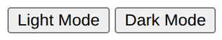

# Problem 3: DOM Style Changes for Theme Buttons

Edit `Lesson 1.3/index.html`:

You are given a page with two buttons that control the page theme.

Write JavaScript that:

1. Selects the following buttons from the DOM using `document.querySelector()`:

   - A button with `id="light-btn"`, stored in a variable called `lightButton`
   - A button with `id="dark-btn"`, stored in a variable called `darkButton`

2. Defines two functions.

   To add or remove a class in JavaScript, use the element's `classList`: `element.classList.add("someClass")` adds a class, and `element.classList.remove("someClass")` removes one. The `<body>` element is available as `document.body`, so you would write things like `document.body.classList.add("someClass")`.

   - `setLightMode`

      - Removes the `dark` class from the `<body>`

      - Adds the `light` class to the `<body>`

   - `setDarkMode`
      - Removes the `light` class from the `<body>`
      - Adds the `dark` class to the `<body>`

After you define both functions, add these exact lines:

```js
lightButton.addEventListener("click", setLightMode);
darkButton.addEventListener("click", setDarkMode);
```

These lines connect each button to the function that should run when the button is clicked. They must come below where you declared `lightButton` and `darkButton`, since the button variables need to exist before you can add a listener to them. The function names do not have parentheses here because the browser should call the function later, when the click happens.

After the page loads in light mode, before either button is clicked, the page should look similar to this image:



---

Course 2, Module 1 - practice assignment (ungraded): [Practice: Accessing the DOM from JavaScript](https://www.coursera.org/learn/building-interactive-web-applications-with-javascript/programming/aL5cv/practice-accessing-the-dom-from-javascript) - `Lesson 1.3`

The files here are the starter you get in the course. The finished `index.html` is in the [solution folder on GitHub](https://github.com/soney/Practical-JavaScript/tree/main/assignments/Course%202/Module%201/Lesson%201/Lesson%201.3/solution); in the course codespace that folder is hidden so you can work the problem first.
