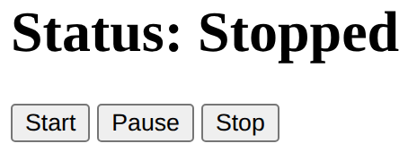

# Problem 4: Text Content for Status Buttons

Edit `Lesson 1.4/index.html`:

You are given a heading that reflects the current status of an application and three control buttons.

Write JavaScript that:

1. Selects the following elements from the DOM:

   - A heading with the id `status`, stored in a variable called `statusHeading`
   - The button with the id `start-btn`, stored in a variable called `startButton`
   - The button with the id `pause-btn`, stored in a variable called `pauseButton`
   - The button with the id `stop-btn`, stored in a variable called `stopButton`

2. Defines three functions:

   - `setStart` updates `statusHeading.textContent` to `"Status: Started"`
   - `setPause` updates `statusHeading.textContent` to `"Status: Paused"`
   - `setStop` updates `statusHeading.textContent` to `"Status: Stopped"`

After you define the three functions, add these exact lines:

```js
startButton.addEventListener("click", setStart);
pauseButton.addEventListener("click", setPause);
stopButton.addEventListener("click", setStop);
```

These lines connect each button to the function that should run when the button is clicked. The function names do not have parentheses here because the browser should call the function later, when the click happens.

After the page shows `Status: Stopped`, the page should look similar to this image:



---

Course 2, Module 1 - practice assignment (ungraded): [Practice: Accessing the DOM from JavaScript](https://www.coursera.org/learn/building-interactive-web-applications-with-javascript/programming/aL5cv/practice-accessing-the-dom-from-javascript) - `Lesson 1.4`

The files here are the starter you get in the course. The finished `index.html` is in the [solution folder on GitHub](https://github.com/soney/Practical-JavaScript/tree/main/assignments/Course%202/Module%201/Lesson%201/Lesson%201.4/solution); in the course codespace that folder is hidden so you can work the problem first.
