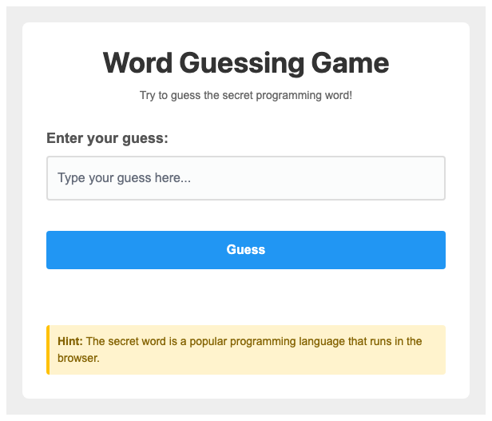

# Problem 1: Query Selectors for a Guessing Game

Edit `Lesson 2.1/main-1.js`:

Set up an interactive word guessing game where users try to guess a secret word.

1. Create a variable called `secretWord` and set it to `"javascript"` (all lowercase)
2. Use `document.querySelector` to get references to each of the following, assigning each to the variable name shown:
   - The input element with ID `guessInput`, stored in a variable called `input`
   - The button element with ID `guessButton`, stored in a variable called `button`
   - The paragraph element with ID `feedback`, stored in a variable called `feedback`
   - The body element (use `document.body` or `document.querySelector('body')`), stored in a variable called `body`
3. Add a click event listener to the guess button that:
   - Gets the current value from the input (convert to lowercase for comparison)
   - Compares the input's lowercased value with `secretWord` using `===`, i.e. `input.value.toLowerCase() === secretWord`
   - If the guess is correct (the text of the `#guessInput` input matches the `secretWord`):
      - Change the feedback paragraph's text content to `"Correct! You guessed it!"`
      - Add the class `"correct"` to the body element
      - Disable the input element by calling `input.setAttribute('disabled', 'true')`
      - Disable the button by calling `button.setAttribute('disabled', 'true')`
   - If the guess is incorrect:
      - Change the feedback paragraph's text content to `"Try again!"`
      - Clear the input's value (set it to an empty string)
      - Focus the input element using `.focus()`

When the page loads, before a guess is entered, it should look similar to this image:

---

Course 2, Module 1 - practice assignment (ungraded): [Practice: Modifying the Page](https://www.coursera.org/learn/building-interactive-web-applications-with-javascript/programming/zGkKP/practice-modifying-the-page) - `Lesson 2.1`

The files here are the starter you get in the course. The finished `main-1.js` is in the [solution folder on GitHub](https://github.com/soney/Practical-JavaScript/tree/main/assignments/Course%202/Module%201/Lesson%202/Lesson%202.1/solution); in the course codespace that folder is hidden so you can work the problem first.
