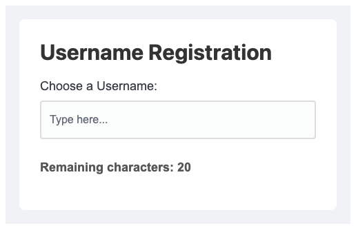

# Problem 3: Input Events for Character Counts

Edit `Lesson 2.3/main-3.js`:

In this exercise, you will read an existing HTML attribute to calculate and display the remaining character count in a text input as the user types.

1.  **Select Elements:** Use `document.querySelector()` to get a reference to each element and store it in a variable:
    * the `<input>` field with the ID `username-field`, stored in a variable named `inputField`
    * the `
` element with the ID `char-count`, stored in a variable named `display`
2.  **Read the `maxlength` attribute:** The `<input>` field already has a `maxlength` attribute set in the HTML that caps how many characters can be entered. If you open `index.html`, you will see `<input ... maxlength="20">`. `maxlength` is a plain HTML attribute, so you read it directly off the input element with `.getAttribute('maxlength')`. Keep in mind that `getAttribute` returns the value as a string (`"20"`), so wrap it in `parseInt()` to convert it into the number `20` before doing any math with it. Store the result in a variable, for example `const maxChars = parseInt(inputField.getAttribute('maxlength'));`.
3.  **Define `updateRemainingCharacters`:** Define a function called `updateRemainingCharacters` that takes no arguments. Each time it runs, it should:
    * Calculate the remaining characters by subtracting the length of the current input value (`inputField.value.length`) from the `maxChars` value you read.
    * Update `display`'s `textContent` to the string `"Remaining characters: X"`, replacing `X` with your calculated number.
4.  **Call it whenever the input changes:** Add an `"input"` event listener to the `username-field` that calls `updateRemainingCharacters`, so it runs every time the user types: `inputField.addEventListener('input', updateRemainingCharacters);`.

After the page loads, before the user types a username, it should look similar to this image:

---

Course 2, Module 1 - practice assignment (ungraded): [Practice: Modifying the Page](https://www.coursera.org/learn/building-interactive-web-applications-with-javascript/programming/zGkKP/practice-modifying-the-page) - `Lesson 2.3`

The files here are the starter you get in the course. [`solution/main-3.js`](solution/main-3.js) is the finished `main-3.js`; copy it over the starter to run the completed assignment.
