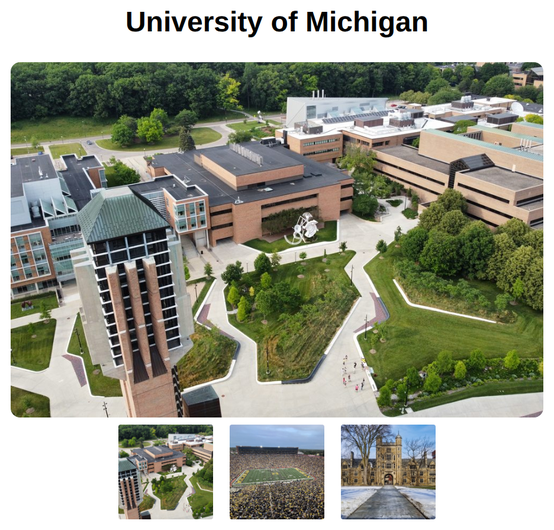

# Problem 4: Attribute Updates for an Image Gallery

Edit `Lesson 2.4/main-4.js`:

Let's create an image gallery with a main display image and thumbnail images. In the JavaScript file:

1.  **Select Elements:**
    * Use `document.querySelectorAll('.thumb')` to get all thumbnail images, and store them in a variable called `thumbnails`.
    * Select the main display `` with the ID `main-view`, and store it in a variable called `mainView`.
2.  **Iterate and Listen:** Loop through `thumbnails` and add a `"click"` event listener to each one. The listener takes a function that runs whenever that thumbnail is clicked.
    * Inside the event listener, use `.getAttribute('src')` to read the `src` of the clicked thumbnail and store it in a variable called `newSrc`. Then call `mainView.setAttribute('src', newSrc)` to update the main image's `src` to that value. This changes the main display image to match the clicked thumbnail.
    * Note: to get a reference to the clicked thumbnail inside the event listener, you can either use the event object (e.g., `event.target`) or refer to the iterated thumbnail variable in the loop.

When the page first loads, before any thumbnail is clicked, it should look similar to this image:

---

Course 2, Module 1 - practice assignment (ungraded): [Practice: Modifying the Page](https://www.coursera.org/learn/building-interactive-web-applications-with-javascript/programming/zGkKP/practice-modifying-the-page) - `Lesson 2.4`

The files here are the starter you get in the course. [`solution/main-4.js`](solution/main-4.js) is the finished `main-4.js`; copy it over the starter to run the completed assignment.
