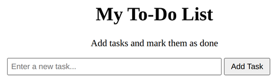
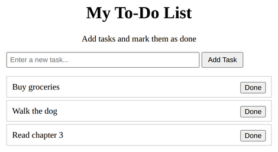

# Problem 1: DOM Element Creation for a Todo List

Edit `Lesson 3.1/main-1.js`:

Build an interactive to-do list where the user can add tasks and mark them as done.

1. Use `document.querySelector` to get references to these elements and store each in a variable:
   - The input element with id `taskInput`, stored in a variable named `input`
   - The button element with id `addButton`, stored in a variable named `button`
   - The unordered list element with id `todoList`, stored in a variable named `list`
2. Define a function called `addTask` that runs when the user clicks the add button. It should:
   - Get the task description from `input.value`
   - If that value is empty or contains only spaces, do nothing (return early)
   - Create a new list item with `document.createElement('li')` and store it in a variable named `taskItem`
   - Set the list item's text to the task description by assigning to its `textContent` property, for example `taskItem.textContent = input.value`. Assigning to `textContent` places that text inside the `<li>` so the task is visible on the page.
   - Create a `"Done"` button with `document.createElement('button')` and set its text content to `"Done"`
   - Add a click event listener to the `"Done"` button. Inside that listener, call `taskItem.remove()`. Every DOM element has a `.remove()` method that deletes it from the page, so clicking `"Done"` takes that task's `<li>` off the list. You call `.remove()` on the element you want gone (`taskItem`).
   - Append the `"Done"` button to `taskItem`, then append `taskItem` to `list`
   - Clear `input`'s value (set `input.value` to an empty string) and focus it using `input.focus()`
3. Add a click event listener to `button` that calls `addTask`.

When the page loads, before any tasks are added, it should look similar to this image:

After adding a few tasks, it should look similar to this. Each task appears as its own list item with a "Done" button that removes it when clicked:

---

Course 2, Module 1 - practice assignment (ungraded): [Practice: Creating and Removing Elements](https://www.coursera.org/learn/building-interactive-web-applications-with-javascript/programming/RjzMb/practice-creating-and-removing-elements) - `Lesson 3.1`

The files here are the starter you get in the course. The finished `main-1.js` is in the [solution folder on GitHub](https://github.com/soney/Practical-JavaScript/tree/main/assignments/Course%202/Module%201/Lesson%203/Lesson%203.1/solution); in the course codespace that folder is hidden so you can work the problem first.
