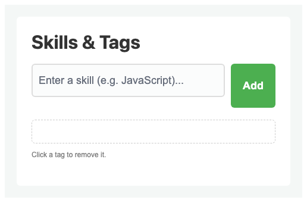
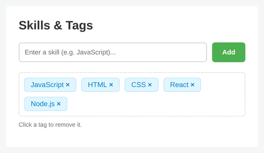

# Problem 2: DOM Creation and Removal for Profile Tags

Edit `Lesson 3.2/main-2.js`:

Many platforms (like LinkedIn or GitHub) allow users to add "tags" or "skills" to their profile. When a user types a skill and clicks "Add," a new tag appears. To ensure a good user experience, each tag must also be removable if it was added by mistake.

It should manage the interaction between an input field, an add button, and a container of tags.

**Part 1: Adding a Tag:**
1. Select Elements: Get references to the following elements and store each in a variable:
   - The `<input>` field with the ID `tag-input`, stored in a variable named `input`.
   - The `<button>` with the ID `add-tag-btn`, stored in a variable named `btn`.
   - The `
` container with the ID `tag-container`, stored in a variable named `container`.

2. Event Listener: Add a `"click"` event listener to `btn`.

3. Create and Append: Inside the click listener:
   - Read `input`'s value and trim it. If it is empty or contains only spaces, do not add a tag (stop here, do not create or append anything).
   - Create a new `` element using `document.createElement()`.
   - Set the `textContent` of this span to that trimmed value.
   - Add the CSS class `"tag-item"` to the span using `.classList.add()`.
   - Append the span to `container` using `.append()`.
   - Clear `input`'s value so the user can type a new tag.

**Part 2: Removing a Tag:**
1. Event Listener: At the moment you create the new tag (inside the "Add" listener), add a `"click"` listener directly to that new `` element.

2. Removal Logic: When the tag is clicked, it should remove itself from the DOM using the `.remove()` method.

When the page loads, before any tags are added, the page should look similar to this image:

After adding a few tags, it should look similar to this. Each tag appears in the container, and clicking a tag removes it:

---

Course 2, Module 1 - practice assignment (ungraded): [Practice: Creating and Removing Elements](https://www.coursera.org/learn/building-interactive-web-applications-with-javascript/programming/RjzMb/practice-creating-and-removing-elements) - `Lesson 3.2`

The files here are the starter you get in the course. The finished `main-2.js` is in the [solution folder on GitHub](https://github.com/soney/Practical-JavaScript/tree/main/assignments/Course%202/Module%201/Lesson%203/Lesson%203.2/solution); in the course codespace that folder is hidden so you can work the problem first.
