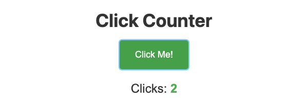

# Problem 1: Click Events for a Button Counter

Edit `Problem 1/main-1.js`:

Do not edit `Problem 1/index.html`.

1. Create a variable named `clickCount` and set it to `0`.
   - Use `let` because `clickCount` changes after each click.
2. Select the button:
   - Use `document.querySelector('#counter-button')`.
3. Select the display span:
   - Use `document.querySelector('#click-display')`.
4. Add a `click` event listener to the button with `addEventListener`. Inside the event listener callback:
   - Increase `clickCount` by `1`.
   - Set `clickDisplay.textContent` to the current `clickCount`.

When the page loads, each button click should update the display from `0` to `1`, then `2`, then `3`, and so on.

When the page loads and the button is clicked twice, the page should look similar to this image:

---

Course 2, Module 2 - graded assignment: [Module 2 Graded Assignment](https://www.coursera.org/learn/building-interactive-web-applications-with-javascript/programming/QKDG9/module-2-graded-assignment) - `Problem 1`

The files here are the starter you get in the course. Solutions to graded
assignments are not published.
