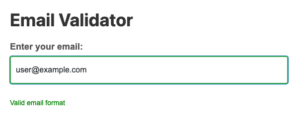

# Problem 2: Input Events for Email Validation

Edit `Problem 2/main-2.js`:

Do not edit `Problem 2/index.html`.

Set up real-time feedback for the email input. The page's stylesheet already defines two classes for the feedback message: `valid` (green text) and `invalid` (red text). Your job is to set the message text and switch between those classes.

1. Select the email input:
   - Use `document.querySelector('#email-input')`.
2. Select the feedback message element:
   - Use `document.querySelector('#feedback-message')`.
3. Add an `input` event listener to the email input with `addEventListener`.
4. Inside the event listener callback:
   - Get the current input value from `event.target.value` or from the input element's `value` property.
   - Check whether the value includes the `@` character.
   - Use the string method `includes('@')`.
5. If the value includes `@`:
   - Set `feedbackMessage.textContent` to `Valid email format`.
   - Add the `valid` class and remove the `invalid` class with `feedbackMessage.classList.add('valid')` and `feedbackMessage.classList.remove('invalid')`.
6. If the value does not include `@`:
   - Set `feedbackMessage.textContent` to `Please include @ in your email`.
   - Add the `invalid` class and remove the `valid` class with `feedbackMessage.classList.add('invalid')` and `feedbackMessage.classList.remove('valid')`.

Typing `user` should show the red message `Please include @ in your email`. Typing `user@example.com` should show the green message `Valid email format`.

When the page loads and `user@example.com` is typed, the page should look similar to this image:

---

Course 2, Module 2 - graded assignment: [Module 2 Graded Assignment](https://www.coursera.org/learn/building-interactive-web-applications-with-javascript/programming/QKDG9/module-2-graded-assignment) - `Problem 2`

The files here are the starter you get in the course. Solutions to graded
assignments are not published.
