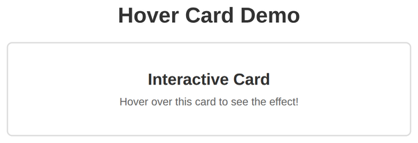
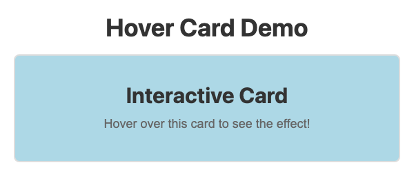

# Problem 3: Mouse Events for a Hover Card

Edit `Problem 3/main-3.js`:

Do not edit `Problem 3/index.html`.

Write code that changes a card's appearance when the user hovers over it. The stylesheet already defines a `hovered` class that gives the card a light blue background, so your job is to add that class on hover and remove it when the pointer leaves.

1. Select the card:
   - Use `document.querySelector('#hover-card')` and store it in a variable named `hoverCard`.
2. Add a `mouseenter` event listener to the card.
   - In the callback, add the `hovered` class with `hoverCard.classList.add('hovered')`.
3. Add a `mouseleave` event listener to the card.
   - In the callback, remove the `hovered` class with `hoverCard.classList.remove('hovered')`.

When the page loads, the card should turn light blue when the pointer enters it and white when the pointer leaves it.

When the page first loads, before hovering, the card is white:

When the pointer enters the card, it turns light blue:

---

Course 2, Module 2 - graded assignment: [Module 2 Graded Assignment](https://www.coursera.org/learn/building-interactive-web-applications-with-javascript/programming/QKDG9/module-2-graded-assignment) - `Problem 3`

The files here are the starter you get in the course. Solutions to graded
assignments are not published.
