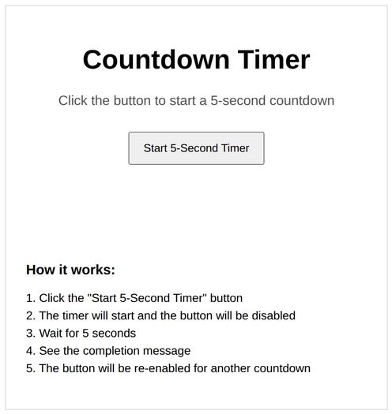
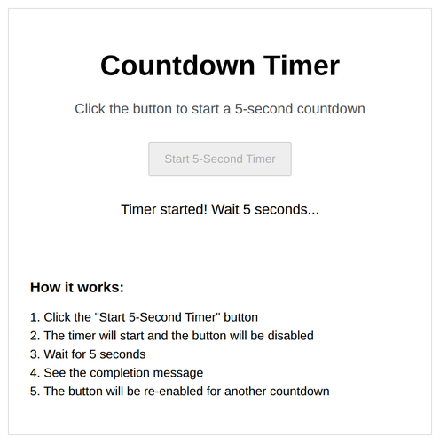
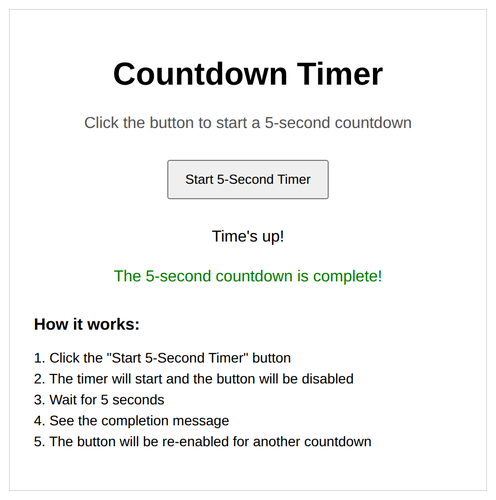

# Problem 1: Timers for a Countdown Button

Edit `Lesson 1.1/main-1.js`:

This will set up an interactive countdown timer where users can start a 5-second countdown that displays feedback when complete.

1. Use `document.querySelector` to get references to these elements and store each in a variable:
    - The button element with id `startButton`, stored in a variable named `button`
    - The paragraph element with id `timerDisplay`, stored in a variable named `display`
    - The paragraph element with id `timerFeedback`, stored in a variable named `feedback`
2. Create a function called `startTimer` that will be called when the user clicks the start button. This function should:
    - Set `display`'s text content to `"Timer started! Wait 5 seconds..."`
    - Set `feedback`'s text content to an empty string (clear any previous feedback)
    - Disable the button by setting `button.disabled` to `true`
    - Create a callback function called `onTimerComplete` that:
        - Sets `display`'s text content to `"Time's up!"`
        - Sets `feedback`'s text content to `"The 5-second countdown is complete!"`
        - Re-enables the button by setting `button.disabled` to `false`
    - Use `setTimeout` to call `onTimerComplete` after 5000 milliseconds (5 seconds)
3. Add a click event listener to `button` that calls the `startTimer` function

When the page loads, before the start button is clicked, the page should look similar to this image:

Right after the button is clicked, the timer starts and the button is disabled:

After 5 seconds, the completion message appears and the button is enabled again:

---

Course 2, Module 2 - practice assignment (ungraded): [Practice: Events and Callbacks](https://www.coursera.org/learn/building-interactive-web-applications-with-javascript/programming/WUDwX/practice-events-and-callbacks) - `Lesson 1.1`

The files here are the starter you get in the course. [`solution/main-1.js`](solution/main-1.js) is the finished `main-1.js`; copy it over the starter to run the completed assignment.
