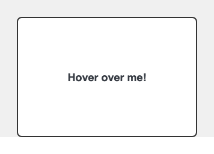
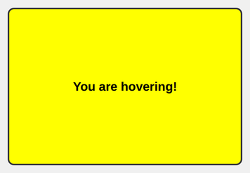

# Problem 2: Mouse Events for a Hover Card

Edit `Lesson 1.2/main-2.js`:

This code will set up a card that changes when the mouse moves over it, then changes back when the mouse leaves. The stylesheet already includes a rule that gives the card a yellow background when it has the `highlight` class, so your job is to add that class when the mouse enters and remove it when the mouse leaves.

1. Use `document.querySelector` to select the `div` with the id `info-card`. Store it in a variable called `infoCard`.

2. Create a function called `highlightCard`. This function should:
   - Add the `highlight` class to the card with `infoCard.classList.add("highlight")`.
   - Set `infoCard.textContent` to `"You are hovering!"`.

3. Create a function called `removeHighlight`. This function should:
   - Remove the `highlight` class from the card with `infoCard.classList.remove("highlight")`.
   - Set `infoCard.textContent` to `"Hover over me!"`.

After you define both functions, add two event listeners to `infoCard`: one for the `"mouseover"` event that runs `highlightCard`, and one for the `"mouseout"` event that runs `removeHighlight`. Pass each function by name, without parentheses, so the browser calls it later when the event happens.

When the page loads, before the pointer moves onto the card, the page should look similar to this image:

When the mouse is over the card, it should look similar to this image:

---

Course 2, Module 2 - practice assignment (ungraded): [Practice: Events and Callbacks](https://www.coursera.org/learn/building-interactive-web-applications-with-javascript/programming/WUDwX/practice-events-and-callbacks) - `Lesson 1.2`

The files here are the starter you get in the course. [`solution/main-2.js`](solution/main-2.js) is the finished `main-2.js`; copy it over the starter to run the completed assignment.
