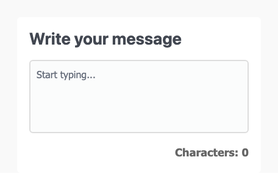
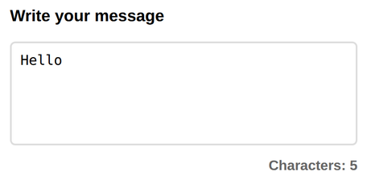

# Problem 3: Input Events for a Character Counter

Edit `Lesson 1.3/main-3.js`:

Practice the `input` event and the event object.
Your code will update a counter as the user types in a textarea.

1. Select the Elements. Use `document.querySelector` to get references to:
    - The `textarea` element with the id `message-input`.
    - The `span` element with the id `char-count`.

2. Create the `updateCount` Function
  Create a function called `updateCount` that takes the event object as a parameter. This function should:
    - Get the length of the current value in the textarea using  
      `event.target.value.length`.
    - Update the `textContent` of `char-count` to display that length.

3. Add an Event Listener
    - Add an event listener to `message-input` that listens for the `"input"` event and calls `updateCount`.
    - The `"input"` event fires every time the value of the textarea changes: on each keystroke, and also when the user pastes or deletes text. Because it runs on every change, `updateCount` keeps the character count up to date as the user types.

When the page loads, before the user types a message, the page should look similar to this image:

After the user types a message, the counter updates to match. For example, after typing `Hello`, the page should look similar to this image:

---

Course 2, Module 2 - practice assignment (ungraded): [Practice: Events and Callbacks](https://www.coursera.org/learn/building-interactive-web-applications-with-javascript/programming/WUDwX/practice-events-and-callbacks) - `Lesson 1.3`

The files here are the starter you get in the course. [`solution/main-3.js`](solution/main-3.js) is the finished `main-3.js`; copy it over the starter to run the completed assignment.
