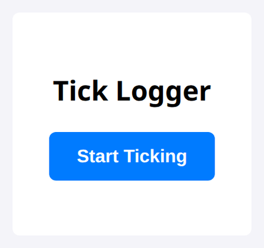
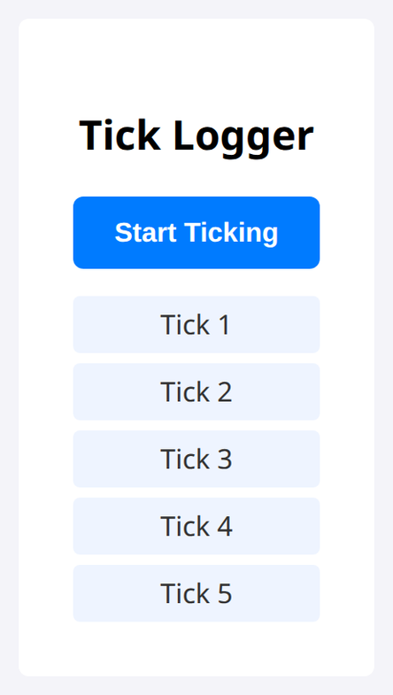

# Problem 4: Intervals for Appending Ticks

Edit `Lesson 1.4/main-4.js`:

Practice `setInterval` and `clearInterval`. Your code will append a new "Tick" line to the page every second, and stop after 5 of them.

1. Select the Elements
   Use `document.querySelector` to get references to these elements and store each in a variable:
    - The `button` element with the id `start-log-btn`, stored in a variable named `button`.
    - The `ul` element with the id `tick-list`, stored in a variable named `tickList`.

2. Create the `startLogging` Function
   Create a function called `startLogging` that:
    - Disables the button by setting `button.disabled` to `true`.
    - Creates a counter variable starting at 0, for example `let count = 0;`.
    - Starts a `setInterval` that runs every **1000 ms** (1 second) and stores the interval ID in a variable named `intervalId`.

   Inside the interval callback function, which runs once every second:
    - Increase `count` by 1.
    - Create a new `<li>` element with `document.createElement("li")`, set its `textContent` to `"Tick " + count`, and append it to `tickList` with `.append()`.
    - If `count` equals `5`:
        - Call `clearInterval(intervalId)` to stop the interval.
        - Re-enable the button by setting `button.disabled` to `false`.

3. Add an Event Listener
    - Add a `"click"` event listener to `button` that calls the `startLogging` function.

When the page loads, before the button is clicked, the page should look similar to this image:

After you click the button, a new "Tick" line is appended once every second. After all 5 ticks, it should look similar to this image:

---

Course 2, Module 2 - practice assignment (ungraded): [Practice: Events and Callbacks](https://www.coursera.org/learn/building-interactive-web-applications-with-javascript/programming/WUDwX/practice-events-and-callbacks) - `Lesson 1.4`

The files here are the starter you get in the course. The finished `main-4.js` is in the [solution folder on GitHub](https://github.com/soney/Practical-JavaScript/tree/main/assignments/Course%202/Module%202/Lesson%201/Lesson%201.4/solution); in the course codespace that folder is hidden so you can work the problem first.
