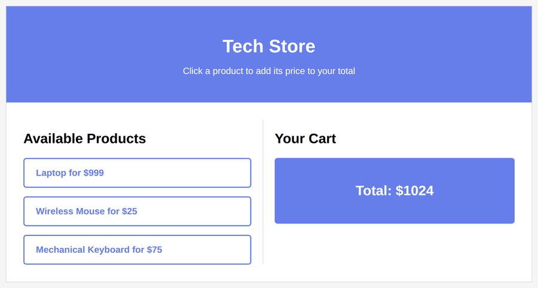

# Problem 1: Event Listeners for a Shopping Cart

Edit `Lesson 2.1/main-1.js`:

This code creates an interactive shopping cart for an online store. The product buttons are not written in the HTML; you will create them from a `products` array. Clicking a product adds its price to a running total.

1. Create an array called `products` with three product objects:

```js
const products = [
  { id: 'laptop', name: 'Laptop', price: 999 },
  { id: 'mouse', name: 'Wireless Mouse', price: 25 },
  { id: 'keyboard', name: 'Mechanical Keyboard', price: 75 }
];
```

2. Use `document.querySelector()` to get references to these elements and store each in a variable:
    - The product list container with `id="productList"`, stored in a variable named `productList`.
    - The paragraph with `id="cartTotal"`, stored in a variable named `cartTotal`.

3. Create a variable named `total` and set it to `0`. Use `let`, because the total changes as products are added.

4. Loop through the `products` array with a `for` loop, such as `for (let i = 0; i < products.length; i++)`. Inside the loop, get the current product with `const product = products[i]`, then:
    - Create a `<button>` element with `document.createElement('button')`.
    - Set the button's text content to the product's name and price, for example `product.name + ' for $' + product.price`.
    - Add the `product-button` class to the button with `.classList.add('product-button')` so it is styled.
    - Add a `"click"` event listener to the button. When it is clicked:
        - Add the product's price to `total`, for example `total = total + product.price`.
        - Set `cartTotal`'s text content to `"Total: $" + total`.
    - Append the button to `productList`.

Note: this cart only keeps a running `total`, so the page can show the total price but not a list of the individual items that were added, and there is no way to remove a single item. To support showing and removing items, you would store each added item in an array and rebuild the cart display from that array whenever it changes.

When the page loads, the three product buttons are created from the `products` array and the total starts at `$0`. The page should look similar to this image:


After clicking the Laptop and Wireless Mouse buttons, the total updates to `$1024`. The page should look similar to this image:



---

Course 2, Module 2 - practice assignment (ungraded): [Practice: Event Propagation and Delegation](https://www.coursera.org/learn/building-interactive-web-applications-with-javascript/programming/BPJLw/practice-event-propagation-and-delegation) - `Lesson 2.1`

The files here are the starter you get in the course. [`solution/main-1.js`](solution/main-1.js) is the finished `main-1.js`; copy it over the starter to run the completed assignment.
