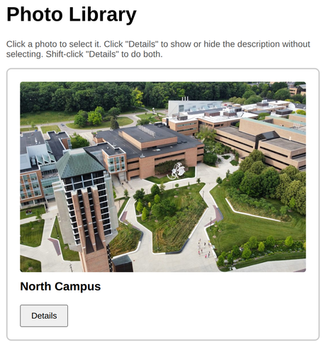
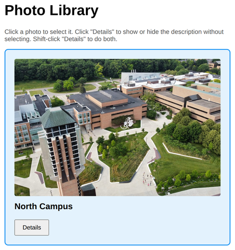
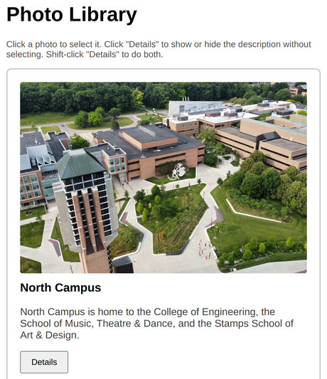

# Problem 2: Event Propagation for a Photo Card

Edit `Lesson 2.2/main-2.js`:

When you click an element, the click also travels up to its parent elements. This is called event bubbling. In this exercise you will use `event.stopPropagation()` to control it.

The page has a photo card (`#card`) with a hidden detailed description (`.details`) and a `Details` button (`#detailsBtn`) inside it. The stylesheet hides the `.details` text by default and shows it whenever the card has the `show-details` class, so you reveal the description by toggling that class.

1. Select the two elements with `document.querySelector()` and store them in variables named `card` and `detailsBtn`.

2. Add a `"click"` event listener to `card`. When the card is clicked, add the `selected` class to `card` with `.classList.add('selected')`.

3. Add a `"click"` event listener to `detailsBtn`. This listener takes the `event` parameter. When the button is clicked:
    - Toggle the `show-details` class on `card` with `card.classList.toggle('show-details')`. Because the stylesheet hides `.details` unless the card has that class, this shows or hides the description.
    - The button is inside the card, so a normal click would also bubble up and select the photo. To stop that, call `event.stopPropagation()` so the card's listener does not run.
    - Exception: if the user is holding Shift (check `event.shiftKey`), do NOT stop propagation. That lets the click bubble up to the card as well, so the photo is also selected. In other words, holding Shift lets the card's action take precedence.
    - The simplest way to write this: call `event.stopPropagation()` only when `event.shiftKey` is `false`.

Behavior summary:
- Click the card (not the button): the photo is selected.
- Click `Details`: the description appears (click again to hide it), and the photo is NOT selected.
- Shift-click `Details`: the description appears and the photo is also selected.

When the page loads, before anything is clicked, the description is hidden and the page should look similar to this image:

After clicking the card, the photo is selected:

After clicking the Details button, the description is shown and the card is not selected:

---

Course 2, Module 2 - practice assignment (ungraded): [Practice: Event Propagation and Delegation](https://www.coursera.org/learn/building-interactive-web-applications-with-javascript/programming/BPJLw/practice-event-propagation-and-delegation) - `Lesson 2.2`

The files here are the starter you get in the course. [`solution/main-2.js`](solution/main-2.js) is the finished `main-2.js`; copy it over the starter to run the completed assignment.
