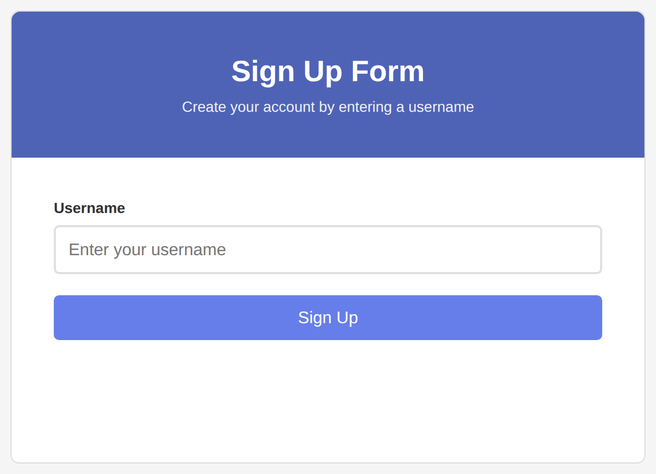
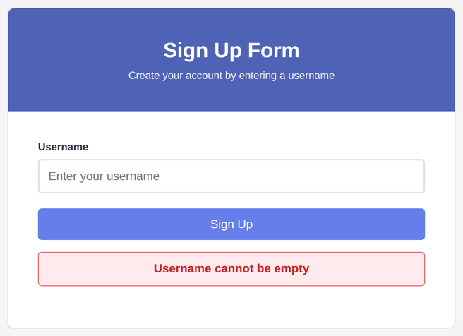
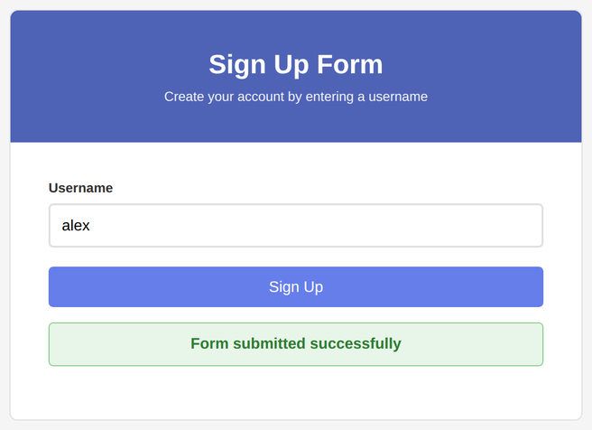

# Problem 3: Prevent Default for Form Validation

Edit `Lesson 2.3/main-3.js`:

Practice preventing default browser behavior and performing basic form validation.

1. Use `document.querySelector()` to get references to:
    - The form with `id="signupForm"`
    - The input with `id="username"`
    - The paragraph with `id="formMessage"`

2. Add a `"submit"` event listener to the form. The callback function should take the event object as a parameter.

3. Inside the event listener, call `event.preventDefault()` so the browser stays on the page while you show a validation message.

4. Check the username input:
    - If `username.value === ''`:
        - Set `formMessage.textContent` to `"Username cannot be empty"`
        - Remove the `empty` and `success` classes from `formMessage`
        - Add the `error` class to `formMessage`
    - Otherwise:
        - Set `formMessage.textContent` to `"Form submitted successfully"`
        - Remove the `empty` and `error` classes from `formMessage`
        - Add the `success` class to `formMessage`

When the page loads, before the form is submitted, the page should look similar to this image:

If you submit the form while the username is empty, the browser stays on the page and an error message appears:

If you fill in a username and submit, a success message appears instead:

---

Course 2, Module 2 - practice assignment (ungraded): [Practice: Event Propagation and Delegation](https://www.coursera.org/learn/building-interactive-web-applications-with-javascript/programming/BPJLw/practice-event-propagation-and-delegation) - `Lesson 2.3`

The files here are the starter you get in the course. [`solution/main-3.js`](solution/main-3.js) is the finished `main-3.js`; copy it over the starter to run the completed assignment.
