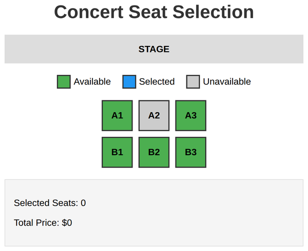
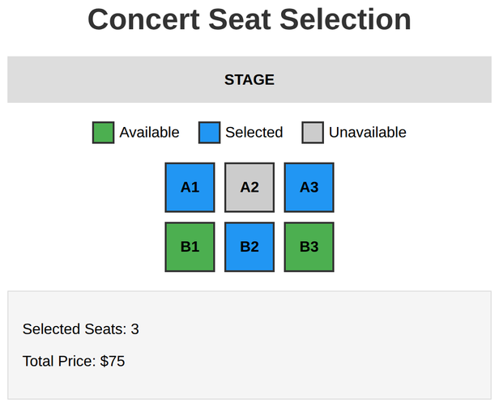

# Problem 1: Scope for Seat Selection

Edit `Lesson 3.1/main-1.js`:

Your code will create an interactive seat selection system where users can select seats and see the total price update.

The element references you need are already provided at the top of `main-1.js`:

```js
const seats = document.querySelectorAll('.seat');
const selectedCount = document.querySelector('#selectedCount');
const totalPrice = document.querySelector('#totalPrice');
```

`seats` is a NodeList of all six seat `<div>` elements, so you can loop over it instead of selecting each seat by its id.

1. Create a helper function called `updateDisplay` (no parameters):
    - Count how many seats have the `selected` class using `document.querySelectorAll('.seat.selected')` and its `length`.
    - Calculate the total price: the number of selected seats times `25`.
    - Set `selectedCount.textContent` to the count.
    - Set `totalPrice.textContent` to `'$' + price`, such as `'$50'`.

2. Create a helper function called `toggleSeat` that takes one parameter, `seat`:
    - If `seat` has the `unavailable` class, return early and do nothing.
    - Otherwise, toggle the `selected` class on `seat` with `.classList.toggle('selected')`.
    - Call `updateDisplay()`.

3. Give every seat a click listener. Loop through `seats` (for example with a `for...of` loop) and, for each `seat`, add a `"click"` listener that calls `toggleSeat(seat)`.

4. Call `updateDisplay()` once at the end to initialize the display.

When the page loads, before any seats are selected, the page should look similar to this image:



After selecting some seats, they turn blue and the count and total price update. For example, with three seats selected:



---

Course 2, Module 2 - practice assignment (ungraded): [Practice: Scope and Functions](https://www.coursera.org/learn/building-interactive-web-applications-with-javascript/programming/urR98/practice-scope-and-functions) - `Lesson 3.1`

The files here are the starter you get in the course. The finished `main-1.js` is in the [solution folder on GitHub](https://github.com/soney/Practical-JavaScript/tree/main/assignments/Course%202/Module%202/Lesson%203/Lesson%203.1/solution); in the course codespace that folder is hidden so you can work the problem first.
