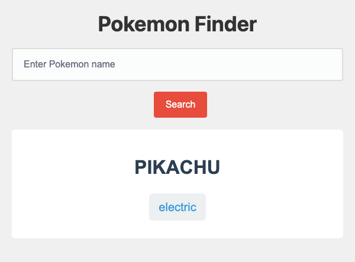

# Problem 1: `fetch()` for a Pokemon Search

Edit `Problem 1/main-1.js`:

- Note 1: For this problem, you will **only** edit the JavaScript file, `Problem 1/main-1.js`. **Do not modify the HTML file**, `Problem 1/index.html`.
- Note 2: The page includes a local cache for the API response so the assignment does not rely on the live API being available. Still write the exact `fetch()` call shown below.

Create an async function that fetches Pokemon data and displays the Pokemon's name and first type.

1. Define an async function named `searchPokemon`.
   - It should take one string parameter named `pokemonName`.
2. Create a variable named `lowerCaseName`.
   - Set it equal to `pokemonName.toLowerCase()`.
   - This stores the searched Pokemon name in lowercase so it can be used in the API URL.
3. Fetch data from this URL:

   ```js
   'https://pokeapi.co/api/v2/pokemon/' + lowerCaseName
   ```

4. Use `await` to wait for `fetch()`.
5. Use `await response.json()` to parse the response body.
6. Store the parsed object in a variable named `pokemonData`.
7. Select the Pokemon name element:
   - Use `document.querySelector('#pokemon-name')`.
   - Set its `textContent` to `pokemonData.name.toUpperCase()`.
8. Select the Pokemon type element:
   - Use `document.querySelector('#pokemon-type')`.
   - Set its `textContent` to `pokemonData.types[0].type.name`.
   - This uses the first type from the `types` array.

For example, calling `searchPokemon('pikachu')` should display `PIKACHU` as the name and `electric` as the type.

After calling `searchPokemon('pikachu')` and receiving the API data, the page should look similar to this image:



---

Course 2, Module 3 - graded assignment: [Module 3 Graded Assignment](https://www.coursera.org/learn/building-interactive-web-applications-with-javascript/programming/TPqOy/module-3-graded-assignment) - `Problem 1`

The files here are the starter you get in the course. Solutions to graded
assignments are not published.
