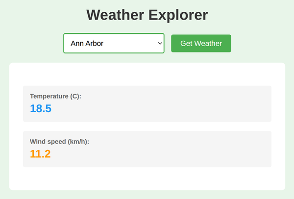

# Problem 2: `fetch()` for a Weather Lookup

Edit `Problem 2/main-2.js`:

- Note 1: For this problem, you will **only** edit the JavaScript file, `Problem 2/main-2.js`. **Do not modify the HTML file**, `Problem 2/index.html`.
- Note 2: The page includes a local cache for the API response so the assignment does not rely on the live API being available. Still write the exact `fetch()` call shown below.

`main-2.js` already provides two things for you, so your only job is the `fetch()` chain:

- `CITY_COORDINATES`: an object that maps each city name to its `{ latitude, longitude }`.
- `getCoordinates(city)`: a function that returns the `{ latitude, longitude }` object for a city name.

Create a function that fetches weather data with a Promise chain and displays the current temperature and wind speed.

1. Define a function named `lookupWeather`.
   - It should take one string parameter named `city`.
2. Call `getCoordinates(city)` to get the city's `{ latitude, longitude }`.
   - Store the result in a variable named `coords`.
3. Return the full `fetch()` Promise chain from the function.
   - Do not return `true` for this problem.
   - Do not use `async` / `await` for this problem.
4. Fetch data from this URL, building it exactly as shown:

   ```js
   'https://api.open-meteo.com/v1/forecast?latitude=' + coords.latitude + '&longitude=' + coords.longitude + '&current_weather=true'
   ```

5. In the first `.then()` callback, return `response.json()`.
6. In the second `.then()` callback:
   - Store the `data.current_weather` object in a variable named `weather`.
   - Select `#weather-temperature` with `document.querySelector`.
   - Set `#weather-temperature` text to `weather.temperature`.
   - Select `#weather-windspeed` with `document.querySelector`.
   - Set `#weather-windspeed` text to `weather.windspeed`.
7. Add a `.catch()` at the end of the chain.
   - In the `.catch()` callback, log the error to the console.

For example, calling `lookupWeather('Ann Arbor')` should display `18.5` as the temperature and `11.2` as the wind speed when the API returns those values.

After calling `lookupWeather('Ann Arbor')` and receiving the API data, the page should look similar to this image:



---

Course 2, Module 3 - graded assignment: [Module 3 Graded Assignment](https://www.coursera.org/learn/building-interactive-web-applications-with-javascript/programming/TPqOy/module-3-graded-assignment) - `Problem 2`

The files here are the starter you get in the course. Solutions to graded
assignments are not published.
