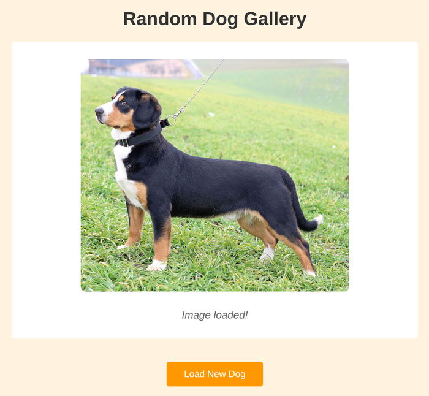

# Problem 3: `fetch()` for a Dog Image Gallery

Edit `Problem 3/main-3.js`:

- Note 1: For this problem, you will **only** edit the JavaScript file, `Problem 3/main-3.js`. **Do not modify the HTML file**, `Problem 3/index.html`.
- Note 2: The page includes a local cache for the API response so the assignment does not rely on the live API being available. Still write the exact `fetch()` call shown below.

Create an async function that fetches a random dog image URL, shows a loading message, and displays the image.

1. Define an async function named `loadDogImage`.
   - The function should not take any parameters.
2. Select the image element:
   - Use `document.querySelector('#dog-image')`.
3. Select the status message element:
   - Use `document.querySelector('#status-message')`.
4. Before fetching, clear the current image:

   ```js
   dogImage.src = '';
   ```

5. Before fetching, set the status text to `Loading image...`.
6. Fetch data from this URL:

   ```js
   'https://dog.ceo/api/breeds/image/random'
   ```

7. Use `await` to wait for `fetch()`.
8. Use `await response.json()` to parse the response body.
9. Store the parsed object in a variable named `dogData`.
10. Set `dogImage.src` to `dogData.message`.
    - The API returns the image URL in the `message` property.
11. Set the status text to `Image loaded!`.

Calling `loadDogImage()` should show `Loading image...`, then display the fetched image URL and show `Image loaded!`.

After calling `loadDogImage()` and the image request finishes, the page should look similar to this image:



---

Course 2, Module 3 - graded assignment: [Module 3 Graded Assignment](https://www.coursera.org/learn/building-interactive-web-applications-with-javascript/programming/TPqOy/module-3-graded-assignment) - `Problem 3`

The files here are the starter you get in the course. Solutions to graded
assignments are not published.
