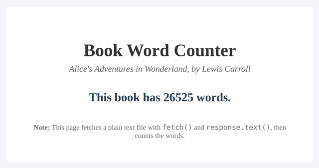

# Problem 1: Fetch a Text File and Count Its Words

Edit `Lesson 1.1/main-1.js`:

Practice the Fetch API with a plain text file. The page loads a real book, *Alice's Adventures in Wonderland*, from a text file called `book.txt` and shows how many words it contains.

A helper function `splitIntoWords(text)` is already provided for you at the top of `main-1.js`. It takes a string and returns an array of its words (it trims the text and splits on whitespace), so you can focus on the fetch.

Define a function called `countBookWords` that takes no arguments. The page already calls `countBookWords()` for you once it loads.

1. **Fetch the file:** use `fetch('book.txt')` to request the text file.
2. **Read the text:** chain `.then(response => response.text())`. A plain text file is read with `.text()` (not `.json()`), which gives you the whole file as one big string.
3. **Count the words:** chain another `.then(text => { ... })` that:
    - Calls `splitIntoWords(text)` to get an array of the words in the book.
    - Counts them with the array's `.length`.
    - Shows the result in the `#result` element, for example `result.textContent = 'This book has ' + count + ' words.'`.
4. **Handle errors:** add a `.catch()` that runs if the request fails. Inside it, log `"Failed to load the book"` with `console.error`, and also show an error message in the `#result` element so the page reflects the failure, for example `result.textContent = 'Failed to load the book.'`. The message shown in `#result` must contain the word `Failed`.

After the book loads and the count appears, the page should look similar to this image:

Book text from Project Gutenberg (public domain).

---

Course 2, Module 3 - practice assignment (ungraded): [Practice: Promises](https://www.coursera.org/learn/building-interactive-web-applications-with-javascript/programming/UyHxd/practice-promises) - `Lesson 1.1`

The files here are the starter you get in the course. [`solution/main-1.js`](solution/main-1.js) is the finished `main-1.js`; copy it over the starter to run the completed assignment.
