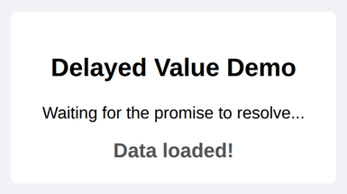

# Problem 2: A Promise That Resolves After a Delay

Edit `Lesson 1.2/main-2.js`:

Practice creating a Promise with `setTimeout`.

Define a function called `resolveAfter` that takes two parameters: a `value` and a number of milliseconds `ms`.

Inside the function:

- Return a new `Promise` using the `new Promise()` constructor.
- Inside the Promise executor, use `setTimeout` to wait `ms` milliseconds.
- After the delay, call `resolve(value)` so the Promise resolves to whatever `value` was passed in.

For example, `resolveAfter("Data loaded!", 2000)` returns a Promise that resolves to the string `"Data loaded!"` after 2 seconds, and `resolveAfter(42, 500)` returns a Promise that resolves to the number `42` after half a second.

**Usage:**

The `#display` element reference is already provided for you at the top of the file. Below your function, call `resolveAfter` and use `.then()` to show the resolved value inside `#display`. To produce exactly the screenshot below (the text `Data loaded!` after 2 seconds), add this usage code beneath your function:

```javascript
resolveAfter("Data loaded!", 2000).then((value) => {
    display.textContent = value;
});
```

After the delay passes and the Promise resolves, the page should look similar to this image:



---

Course 2, Module 3 - practice assignment (ungraded): [Practice: Promises](https://www.coursera.org/learn/building-interactive-web-applications-with-javascript/programming/UyHxd/practice-promises) - `Lesson 1.2`

The files here are the starter you get in the course. The finished `main-2.js` is in the [solution folder on GitHub](https://github.com/soney/Practical-JavaScript/tree/main/assignments/Course%202/Module%203/Lesson%201/Lesson%201.2/solution); in the course codespace that folder is hidden so you can work the problem first.
