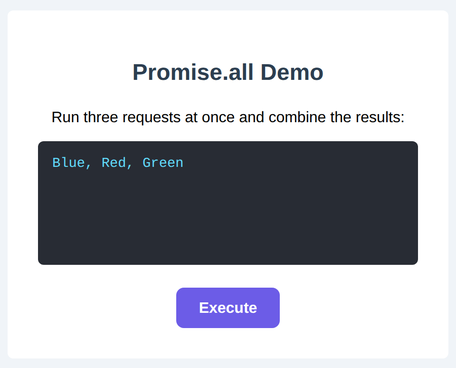

# Problem 3: Wait for Several Promises with `Promise.all`

Edit `Lesson 1.3/main-3.js`:

When several promises are running at once, the built-in `Promise.all` lets you wait for all of them to finish and get their results together. It resolves to an array of the results in the **same order** as the array you pass in, and if any one of the promises rejects, the whole thing rejects with that error.

Three simulated requests are already created for you: `p1`, `p2`, and `p3`, which resolve to `'Blue'`, `'Red'`, and `'Green'` at different times. The DOM references and the button's click handler (which first shows `Running...`) are also provided.

Inside the button's click handler, do the following:

1. Call `Promise.all([p1, p2, p3])`. It returns a single promise that resolves once all three have finished, to an array of their results in order: `['Blue', 'Red', 'Green']`.
2. Chain `.then((results) => { ... })` and show the results in the display, joined with `', '`, for example `display.innerText = results.join(', ');`.

After you click `Execute` and all three requests finish, the display shows the combined results in order. The page should look similar to this image:

---

Course 2, Module 3 - practice assignment (ungraded): [Practice: Promises](https://www.coursera.org/learn/building-interactive-web-applications-with-javascript/programming/UyHxd/practice-promises) - `Lesson 1.3`

The files here are the starter you get in the course. [`solution/main-3.js`](solution/main-3.js) is the finished `main-3.js`; copy it over the starter to run the completed assignment.
