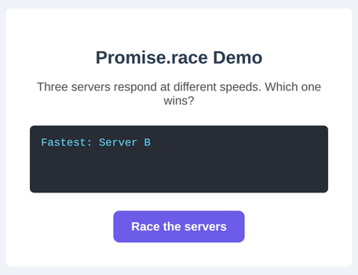

# Problem 4: Get the Fastest Result with `Promise.race`

Edit `Lesson 1.4/main-4.js`:

Sometimes you do not want to wait for every promise, just the first one to finish. Where `Promise.all` waits for *all* of the promises, the built-in `Promise.race` takes an array of promises and settles as soon as the **first** one settles, with that promise's value.

Three simulated servers are already created for you: `serverA`, `serverB`, and `serverC`, which respond at different speeds. The DOM references and the button's click handler (which first shows `Racing...`) are also provided.

Inside the button's click handler, do the following:

1. Call `Promise.race([serverA, serverB, serverC])`. It returns a promise that resolves with the value of whichever server responds first.
2. Chain `.then((winner) => { ... })` and show the winner in the display, for example `display.innerText = 'Fastest: ' + winner;`.

After you click `Race the servers`, the display shows which server won the race. The page should look similar to this image:

---

Course 2, Module 3 - practice assignment (ungraded): [Practice: Promises](https://www.coursera.org/learn/building-interactive-web-applications-with-javascript/programming/UyHxd/practice-promises) - `Lesson 1.4`

The files here are the starter you get in the course. [`solution/main-4.js`](solution/main-4.js) is the finished `main-4.js`; copy it over the starter to run the completed assignment.
