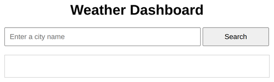
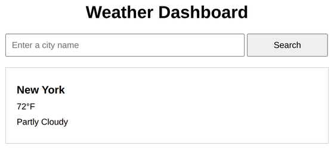

# Problem 1: Fetching External Data for a Weather Dashboard

Edit `Lesson 2.1/main-1.js`:

Your code will create a weather dashboard. When the user types a city and clicks Search, your code fetches weather data from `weather.json` and displays it. The data in `weather.json` is an object whose keys are lowercase city names:

```json
{
  "new york": { "city": "New York", "temperature": 72, "conditions": "Partly Cloudy" },
  "los angeles": { "city": "Los Angeles", "temperature": 85, "conditions": "Sunny" },
  "chicago": { "city": "Chicago", "temperature": 68, "conditions": "Cloudy" }
}
```

1. Use `document.querySelector()` to get references to these elements and store each in a variable:
    - The button with `id="searchButton"`, stored in `searchButton`.
    - The input with `id="cityInput"`, stored in `cityInput`.
    - The paragraph with `id="cityName"`, stored in `cityName`.
    - The paragraph with `id="temperature"`, stored in `temperature`.
    - The paragraph with `id="conditions"`, stored in `conditions`.

2. Add a `"click"` event listener to `searchButton`. Inside the listener:
    - Read what the user typed and lowercase it, for example `const city = cityInput.value.trim().toLowerCase()`.
    - Fetch the data with `fetch('weather.json')`.
    - Chain `.then(response => response.json())` to turn the response into a JavaScript object.
    - Chain another `.then(data => { ... })`. Inside it:
        - Look up the city with `const weather = data[city]`.
        - If `weather` exists, display it:
            - Set `cityName.textContent` to `weather.city`.
            - Set `temperature.textContent` to `weather.temperature + '°F'`.
            - Set `conditions.textContent` to `weather.conditions`.
        - If `weather` is not found, set `cityName.textContent` to `"City not found"` and set `temperature.textContent` and `conditions.textContent` to `""`.

When the page loads, before a city is searched, the page should look similar to this image:



After searching for a city, its weather appears in the box:



---

Course 2, Module 3 - practice assignment (ungraded): [Practice: Fetching External Data](https://www.coursera.org/learn/building-interactive-web-applications-with-javascript/programming/i2FHW/practice-fetching-external-data) - `Lesson 2.1`

The files here are the starter you get in the course. [`solution/main-1.js`](solution/main-1.js) is the finished `main-1.js`; copy it over the starter to run the completed assignment.
