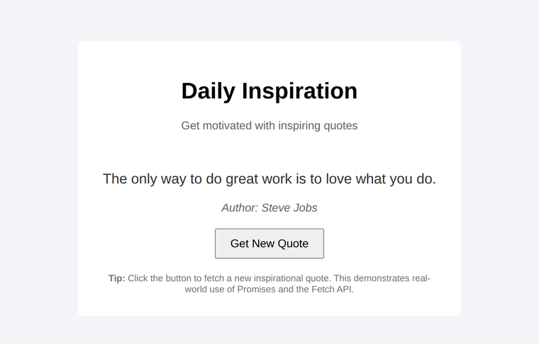

# Problem 2: Promises for a Quote Generator

Edit `Lesson 2.2/main-2.js`:

You will finish an interactive quote generator that fetches quotes from a JSON file. The file `quotes.json` is an array of quote objects, and each object has a `text` (the quote) and an `author`. The DOM references and three helper functions are already provided for you:

- `showLoading()` shows a "Loading quote..." message.
- `displayQuote(quote)` shows a quote object (its `text` and `author`) on the page.
- `handleError(error)` shows an error message if something goes wrong.

Your job is to write the two functions that work with Promises, then wire up the button.

1. Create the `fetchQuote` function. It returns a Promise that resolves to a random quote object:
    - Use `fetch('quotes.json')` to fetch the quotes file.
    - Chain `.then(response => response.json())` to parse the JSON into an array of quote objects.
    - Chain another `.then(data => { ... })` that picks a random object from the array and returns it, for example `data[Math.floor(Math.random() * data.length)]`. That object (with its `text` and `author`) is the value your Promise resolves to, and it is what gets passed to `displayQuote`.

2. Create the `loadQuote` function (no parameters):
    - Call `showLoading()` first.
    - Call `fetchQuote()`, then chain `.then(displayQuote)` to show the returned quote and `.catch(handleError)` to handle any failure.

3. Add a `"click"` event listener to `button` that calls `loadQuote`.

4. Call `loadQuote()` once at the end so a quote appears when the page first loads.

When the page loads and the initial quote loads, the page should look similar to this image:

Quote data adapted from a public compilation by [nasrulhazim](https://gist.github.com/nasrulhazim/54b659e43b1035215cd0ba1d4577ee80).

---

Course 2, Module 3 - practice assignment (ungraded): [Practice: Fetching External Data](https://www.coursera.org/learn/building-interactive-web-applications-with-javascript/programming/i2FHW/practice-fetching-external-data) - `Lesson 2.2`

The files here are the starter you get in the course. The finished `main-2.js` is in the [solution folder on GitHub](https://github.com/soney/Practical-JavaScript/tree/main/assignments/Course%202/Module%203/Lesson%202/Lesson%202.2/solution); in the course codespace that folder is hidden so you can work the problem first.
