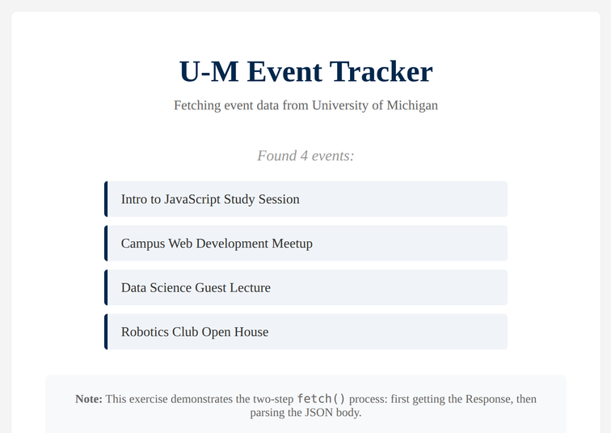

# Problem 3: `fetch()` a List of Events

Edit `Lesson 2.3/main-3.js`:

Practice the Fetch API and the two-step `.json()` process, then show the results on the page.

Define a function called `getUMichEvents` that takes no arguments.

The page includes a local cache for the API response so the assignment does not rely on the live API being available. Still write the exact `fetch()` call shown below.

**Step 1: Fetch the Data**
- Use `fetch()` to call the following URL:
  `https://events.umich.edu/day/json?v=2`
- Use `.then()` to capture the `Response` object, and convert it to JSON with `.json()`.

**Step 2: Build the List**
- Use another `.then()` to receive the parsed JSON data.
- The JSON response is an object, so use `Object.values(data)` to turn it into an array of event objects. Each event object has a `title` property.
- Get the `<ul id="eventList">` element that is already in the page.
- Before adding any items, clear the list with `eventList.innerHTML = ""`. This resets the list so that if `getUMichEvents()` runs more than once, you do not end up with duplicate entries.
- For each event in the array, create an `<li>`, set its text to the event's `title`, and append it to the list. (`document.createElement`, `element.textContent`, and `list.append` are helpful here.)

**Step 3: Error Handling**
- Add a `.catch()` block.
- If the network request fails, log the message `"Failed to fetch events"` with `console.error`.

The page already calls `getUMichEvents()` for you once it loads. After the request succeeds and the titles are shown, the page should look similar to this image:

---

Course 2, Module 3 - practice assignment (ungraded): [Practice: Fetching External Data](https://www.coursera.org/learn/building-interactive-web-applications-with-javascript/programming/i2FHW/practice-fetching-external-data) - `Lesson 2.3`

The files here are the starter you get in the course. The finished `main-3.js` is in the [solution folder on GitHub](https://github.com/soney/Practical-JavaScript/tree/main/assignments/Course%202/Module%203/Lesson%202/Lesson%202.3/solution); in the course codespace that folder is hidden so you can work the problem first.
