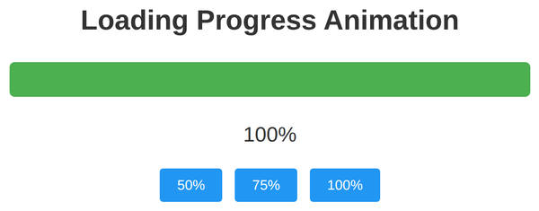

# Problem 1: CSS Transitions for a Progress Bar

Edit `Problem 1/index.html`:

The page has three buttons (`50%`, `75%`, `100%`). The JavaScript in `main-1.js` is already written for you and wires them up: clicking a button calls `setProgress(percent)`, which sets the progress fill to that width and updates the label. Right now the bar jumps straight to the new width instantly. Your job is to make the width change smoothly by adding a CSS **transition**, written as real CSS in the `<style>` block of `index.html`.

1. Open `index.html` and find the `#progress-fill` rule inside the `<style>` block.
2. Add a `transition` property to that rule so that changes to the `width` animate over **2 seconds** using the built-in `ease-in-out` timing function:

    ```css
    transition: width 2s ease-in-out;
    ```

3. Save and click a button. The bar should now ease smoothly to the chosen width instead of snapping.

After clicking `100%` and the bar finishes filling, the page should look similar to this image:



---

Course 2, Module 4 - graded assignment: [Module 4 Graded Assignment](https://www.coursera.org/learn/building-interactive-web-applications-with-javascript/programming/67Rda/module-4-graded-assignment) - `Problem 1`

The files here are the starter you get in the course. Solutions to graded
assignments are not published.
