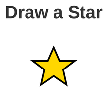

# Problem 2: Draw an SVG Star

Edit `Problem 2/main-2.js`:

- Note 1: For this problem, you will **only** edit the JavaScript file, `Problem 2/main-2.js`. **Do not modify the HTML file**, `Problem 2/index.html`.

Draw a single SVG star inside the `<svg id="star-container">` box.

1. Select the SVG container:
   - Use `document.querySelector('#star-container')`.
2. Create an SVG `<polygon>` element:

   ```js
   document.createElementNS('http://www.w3.org/2000/svg', 'polygon')
   ```

3. Set the polygon's `points` attribute to this exact value:

   ```text
   50,15 61,40 88,40 67,56 73,83 50,67 27,83 33,56 12,40 39,40
   ```

4. Give the star a `fill` color (for example, `gold`).
5. Give the star a `stroke` of `black`.
6. Give the star a `stroke-width` (for example, `3`).
7. Append the polygon to `#star-container`.

When the page loads, it should look similar to this image:



---

Course 2, Module 4 - graded assignment: [Module 4 Graded Assignment](https://www.coursera.org/learn/building-interactive-web-applications-with-javascript/programming/67Rda/module-4-graded-assignment) - `Problem 2`

The files here are the starter you get in the course. Solutions to graded
assignments are not published.
