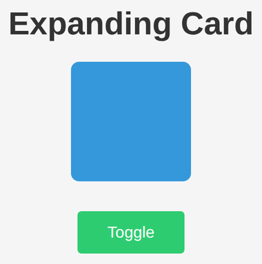

# Problem 3: CSS Transitions Between States

Edit `Problem 3/index.html`:

The JavaScript in `main-3.js` is already written for you: each time you click the **Toggle** button, it adds or removes an `active` class on the box. That `active` class switches the box between two very different states - a small blue rounded square and a large red circle. Right now the box snaps instantly between those states. Your job is to make it animate smoothly by adding a CSS **transition**, written as real CSS in the `<style>` block of `index.html`.

1. Open `index.html` and find the `#box` rule inside the `<style>` block.
2. Add a `transition` property to that rule so that the changes (width, height, background color, and border radius) animate over about **0.5 seconds** using `ease-in-out` timing. You can transition every property at once with the `all` keyword:

    ```css
    transition: all 0.5s ease-in-out;
    ```

3. Save and click the Toggle button. The box should now grow, change color, and round its corners smoothly instead of snapping between the two states.

When the page loads, before the button is clicked, the page should look similar to this image:



---

Course 2, Module 4 - graded assignment: [Module 4 Graded Assignment](https://www.coursera.org/learn/building-interactive-web-applications-with-javascript/programming/67Rda/module-4-graded-assignment) - `Problem 3`

The files here are the starter you get in the course. Solutions to graded
assignments are not published.
